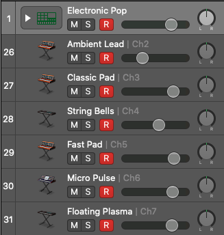

## JSMidi Examples: 10 Part Electronic

This is a simple 10 part electronic song using Logic Pro X software instruments
without any modifications made. See the instrument list below and the screenshot
for the levels I used. Also please read the documentation on
[multi track setup](https://github.com/aaronats/jsmidi/blob/master/docs/LOGIC.md#multitrack).

Here is the [track on SoundCloud](https://soundcloud.com/aaron-strachan-704055056/jsmidi-examples-electronic).

#### Usage

To use this yourself just clone the jsmidi-examples repo, navigate to the `electronic`
folder and run `npm install`. Open the project in Atom, setup your project in Logic
and you should be good to go.

#### Tracks

1. Electronic Pop: `Electronic Drum Kit -> Electronic Pop`
2. Ambient Lead: `Lead -> Ambient Lead`
3. Classic Pad: `Classics -> Classic Pad`
4. String Bells: `Bells -> String Bells`
5. Fast Pad: `Pad -> Fast Pad`
6. Micro Pulse: `Classics -> Micro Pulse`
7. Floating Plasma: `Pad -> Floating Plasma`

